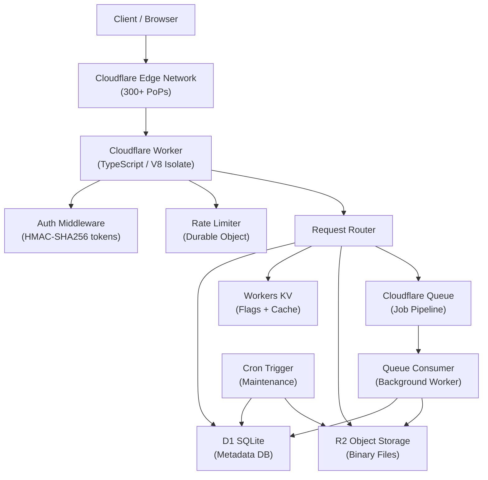
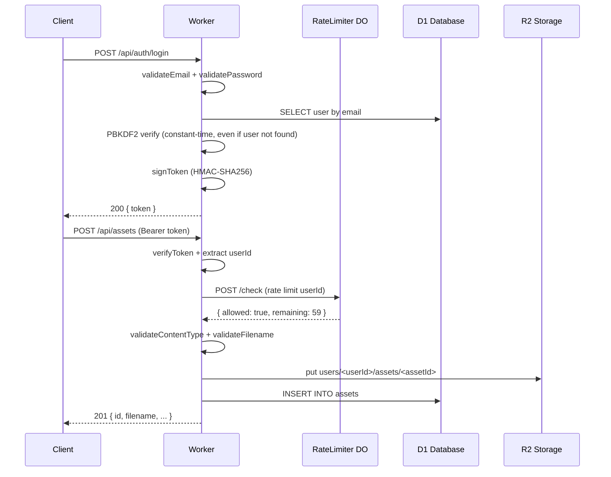
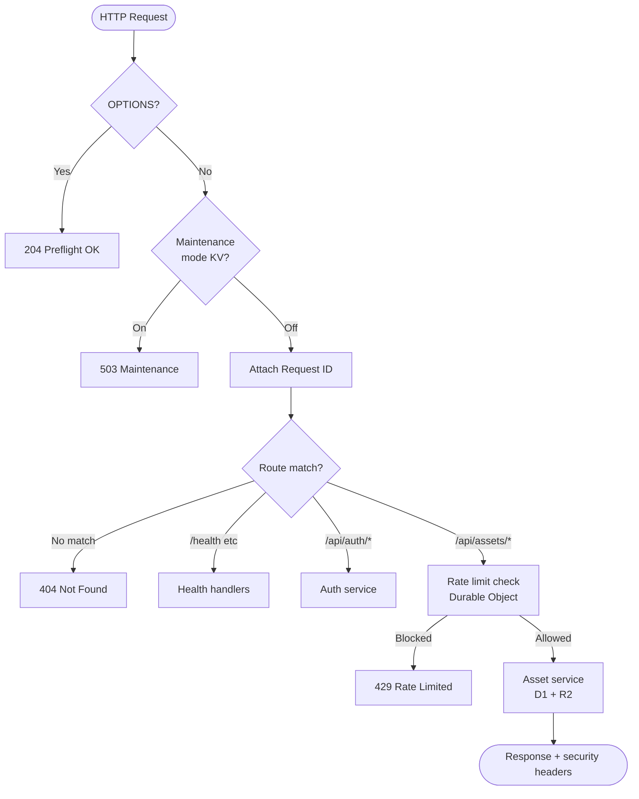
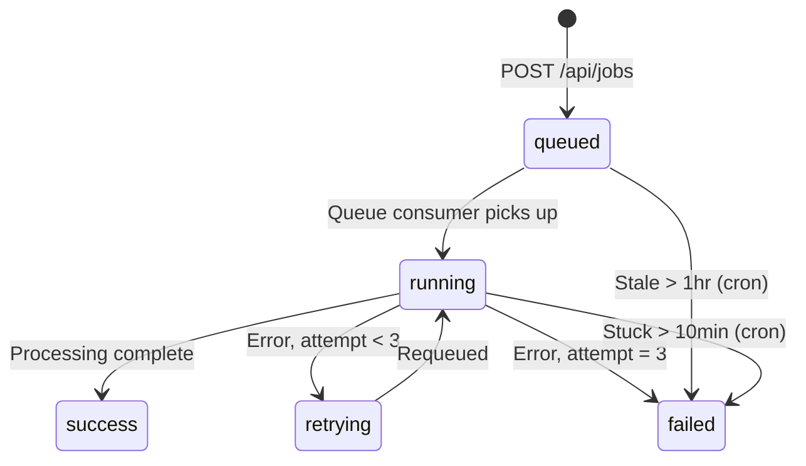

# EdgeForge — Production-Style Cloudflare Edge & Serverless Platform

[](https://www.typescriptlang.org/)
[](https://workers.cloudflare.com/)
[](https://vitest.dev/)
[](LICENSE)

A **production-style asset management platform** built entirely on Cloudflare's edge and serverless primitives. Zero traditional infrastructure — no VMs, no containers, no load balancers. Everything runs at the edge in V8 isolates across Cloudflare's 300+ PoPs.

> **Portfolio note**: This project demonstrates production engineering practices for serverless platforms — auth, rate limiting, async processing, caching, CI/CD, and observability — using Cloudflare's full stack. Deployment status for each component is clearly documented; no results are fabricated.

---

## Platform Architecture



---

## Feature Matrix

| Feature | Implementation | Status |
|---------|---------------|--------|
| **Cloudflare Workers** | TypeScript, V8 isolates, `fetch` + `queue` + `scheduled` handlers | ✅ Config validated |
| **D1 SQLite** | Users, assets, jobs, downloads, audit_events with FK constraints | ✅ Config validated |
| **Workers KV** | Feature flags (every request) + public metadata cache (5min TTL) | ✅ Config validated |
| **R2 Object Storage** | Binary blobs under `users/<uid>/assets/<aid>` key pattern | ✅ Config validated |
| **Durable Objects** | Per-user atomic rate limiting (60 req/60s, configurable) | ✅ Unit tested |
| **Cloudflare Queues** | Async job processing with retry (3 attempts) + dead-letter | ✅ Config validated |
| **Cron Triggers** | Daily cleanup (`0 2 * * *`) + 30-min stuck job detection | ✅ Config validated |
| **PBKDF2-SHA256 auth** | 100k iterations, 16-byte random salt, Web Crypto API only | ✅ Unit tested |
| **HMAC-SHA256 tokens** | Custom JWT-style, 24h expiry, no external lib | ✅ Unit tested |
| **Timing-safe login** | Constant-time even for non-existent users | ✅ Unit tested |
| **IDOR protection** | Ownership check at service layer + R2 key validation | ✅ Security tested |
| **Path traversal prevention** | Hex-only IDs + `validateObjectKey()` on all R2 ops | ✅ Security tested |
| **Rate limiting** | Durable Object, atomic counter, no race conditions | ✅ Unit tested |
| **Cache privacy** | Auth endpoints `no-store`, public endpoint `public max-age=300` | ✅ Unit tested |
| **Security headers** | HSTS, CSP, X-Frame-Options, nosniff on every response | ✅ Integration tested |
| **Maintenance mode** | KV feature flag, instant global propagation | ✅ Config validated |
| **Structured logging** | JSON logs with request_id, level, event, duration | ✅ Implemented |
| **CI/CD** | GitHub Actions: lint + typecheck + 4 test suites on every PR | ✅ Config validated |
| **Staging environment** | Isolated D1/KV/R2/Queue, auto-deploy on `main` push | ✅ Config validated |
| **Production deployment** | Manual dispatch with `confirm: DEPLOY` gate | ✅ Config validated |
| **Rollback** | `wrangler rollback`, documented in runbook | ✅ Config validated |
| **Load testing** | k6 with 3 scenarios, thresholds, summary JSON | ✅ Config validated |

---

## Security Architecture



---

## Request Lifecycle



---

## Job Processing Pipeline



---

## Technology Stack

| Layer | Technology | Why |
|-------|-----------|-----|
| Runtime | Cloudflare Workers (V8) | Zero cold starts, 300+ PoPs, no server management |
| Relational DB | D1 (SQLite) | Serverless SQL, proper FKs, co-located with Workers |
| Key-Value | Workers KV | Eventually-consistent edge reads for flags/cache |
| Object Storage | R2 | S3-compatible, zero egress fees, 50MB objects |
| Coordination | Durable Objects | Atomic counters without external Redis |
| Async | Cloudflare Queues | Decoupled job processing, built-in retry |
| Scheduling | Cron Triggers | Serverless cron, no external scheduler |
| Language | TypeScript 5.4 | End-to-end types, strict mode, Workers-compatible |
| Testing | Vitest | Fast, ESM-native, no Jest compatibility hacks |
| Load testing | k6 | Industry-standard, scriptable scenarios |
| CI/CD | GitHub Actions | Lint + typecheck + test on PR, deploy on merge |

---

## Project Structure

```
src/
├── index.ts                  # Entry: fetch, queue, scheduled handlers
├── types.ts                  # All interfaces (Env, User, Asset, Job, ...)
├── config.ts                 # Config, allowed content types, KV keys
├── durable-objects/
│   └── RateLimiter.ts        # Per-user atomic rate limiting
├── middleware/
│   ├── auth.ts               # Token verification, admin auth
│   ├── error-handler.ts      # Error → HTTP response mapping
│   ├── rate-limit.ts         # DO stub invocation
│   ├── request-id.ts         # X-Request-ID generation/forwarding
│   └── security.ts           # Security + CORS headers
├── routes/
│   ├── assets.ts             # Asset CRUD + public metadata
│   ├── auth.ts               # Register, login, logout, me
│   ├── health.ts             # Health, version endpoints
│   ├── jobs.ts               # Job create + status
│   └── stats.ts              # Stats + admin flag CRUD
├── services/
│   ├── asset-service.ts      # Asset business logic (IDOR-safe)
│   ├── auth-service.ts       # Register/login with timing safety
│   ├── cache-service.ts      # KV metadata cache
│   ├── job-service.ts        # Job creation + ownership check
│   ├── stats-service.ts      # Parallel D1 stats queries
│   └── storage-service.ts    # Feature flag CRUD
├── bindings/
│   ├── d1.ts                 # D1 query wrappers
│   ├── kv.ts                 # KV get/put/delete wrappers
│   ├── queue.ts              # Queue enqueue wrappers
│   └── r2.ts                 # R2 put/get/head/delete wrappers
├── queue/
│   └── consumer.ts           # Queue message processor, retry logic
├── scheduled/
│   └── maintenance.ts        # Cron: cleanup, stuck jobs, daily stats
├── observability/
│   ├── logging.ts            # Structured JSON logging
│   └── telemetry.ts          # Span + metric emission
└── utils/
    ├── crypto.ts             # PBKDF2, HMAC-SHA256, token sign/verify
    ├── errors.ts             # Error class hierarchy
    ├── ids.ts                # ID generation, object key construction
    └── validation.ts         # Email, filename, content type validation

migrations/
├── 0001_initial.sql          # Tables: users, assets, jobs, downloads, audit_events
├── 0002_indexes.sql          # FK and status column indexes
└── 0003_audit.sql            # Composite audit index, stuck job index

tests/
├── unit/                     # Crypto, rate limiter DO, utils, errors, cache
├── integration/              # Auth flow, middleware, response helpers
├── security/                 # IDOR, path traversal, injection
└── e2e/                      # Full 9-step user journey

.github/workflows/
├── ci.yml                    # PR: typecheck, lint, all test suites, npm audit
├── deploy-staging.yml        # Push to main: test + deploy + migrate + smoke
└── deploy-production.yml     # Manual: confirm gate + test + deploy + migrate
```

---

## API Quick Reference

| Method | Path | Auth | Description |
|--------|------|------|-------------|
| `POST` | `/api/auth/register` | None | Register (returns token) |
| `POST` | `/api/auth/login` | None | Login (returns token) |
| `POST` | `/api/auth/logout` | Bearer | Logout (audit event) |
| `GET` | `/api/me` | Bearer | Current user info |
| `POST` | `/api/assets` | Bearer | Upload asset (binary body) |
| `GET` | `/api/assets` | Bearer | List my assets |
| `GET` | `/api/assets/:id` | Bearer | Get asset metadata |
| `GET` | `/api/assets/:id/download` | Bearer | Download file (R2 stream) |
| `DELETE` | `/api/assets/:id` | Bearer | Soft delete asset |
| `GET` | `/api/public/assets/:id` | None | Public metadata (CDN-cached) |
| `POST` | `/api/jobs` | Bearer | Create processing job |
| `GET` | `/api/jobs/:id` | Bearer | Get job status |
| `GET` | `/api/stats` | Bearer | My usage statistics |
| `PUT` | `/api/admin/flags/:name` | Admin key | Set feature flag |
| `GET` | `/health` | None | Health check |

Full API reference: [docs/api.md](docs/api.md)

---

## Getting Started

```bash
# Install dependencies
npm install

# Copy secrets template
cp .dev.vars.example .dev.vars
# Add JWT_SECRET and ADMIN_API_KEY to .dev.vars

# Run migrations locally
npm run migrate:local

# Start dev server (Miniflare emulates all Cloudflare bindings)
npm run dev

# Run all tests
npm test

# Type check + lint
npm run typecheck && npm run lint
```

For deployment: [docs/deployment.md](docs/deployment.md)

---

## Documentation

| Doc | Description |
|-----|-------------|
| [docs/architecture.md](docs/architecture.md) | System design and component overview |
| [docs/api.md](docs/api.md) | Full API reference with request/response examples |
| [docs/security.md](docs/security.md) | Auth, IDOR, rate limiting, headers, cache privacy |
| [docs/threat-model.md](docs/threat-model.md) | 11 threat scenarios with mitigations |
| [docs/caching.md](docs/caching.md) | KV + CDN caching strategy |
| [docs/deployment.md](docs/deployment.md) | First-time setup, CI/CD, rollback |
| [docs/environments.md](docs/environments.md) | Dev / staging / production isolation |
| [docs/failure-tests.md](docs/failure-tests.md) | Covered failure scenarios and test status |
| [docs/performance.md](docs/performance.md) | Load test config and performance characteristics |
| [docs/runbook.md](docs/runbook.md) | Incident response playbook |
| [docs/decisions.md](docs/decisions.md) | Architecture decision records (ADRs) |

---

## License

MIT — see [LICENSE](LICENSE)
