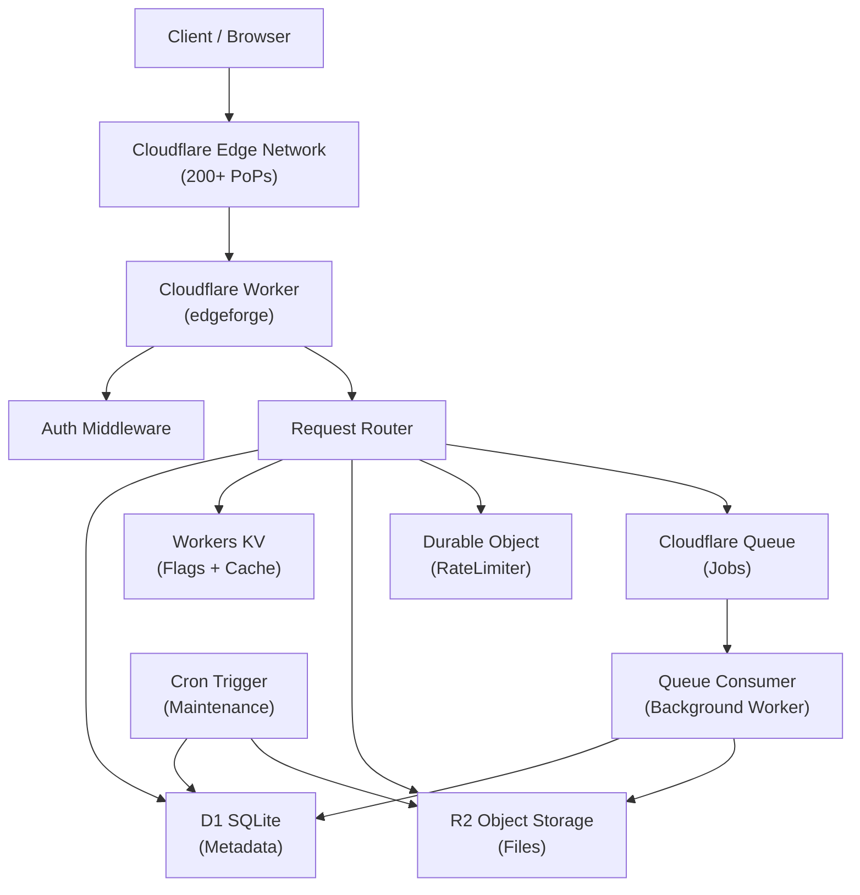

# EdgeForge Architecture

## Overview

EdgeForge is a production-style asset management platform built entirely on Cloudflare's edge and serverless primitives. It demonstrates how modern cloud-native platforms can eliminate traditional infrastructure (VMs, Kubernetes, load balancers) and run entirely at the edge.

## Architecture Diagram

## Component Responsibilities

| Component | Technology | Responsibility |
|-----------|-----------|----------------|
| Edge Worker | Cloudflare Worker | HTTP routing, auth, middleware |
| Metadata | D1 (SQLite) | Authoritative relational data |
| Flags/Cache | Workers KV | Feature flags, metadata cache |
| Files | R2 | Actual binary objects |
| Rate Limiting | Durable Object | Per-user request coordination |
| Jobs | Cloudflare Queues | Async processing pipeline |
| Maintenance | Cron Trigger | Cleanup, stats, stuck job detection |

## Key Design Decisions

1. **No containers**: All compute runs as Workers (V8 isolates), no server management
2. **D1 for relational data**: User/asset/job metadata with proper indexes and foreign keys
3. **KV for edge reads**: Feature flags read at every request — KV's eventually-consistent low-latency model is ideal
4. **R2 for blobs**: Never store binary data in D1; R2 provides S3-compatible object storage with zero egress fees
5. **Durable Objects for coordination**: Rate limiting requires atomic counters across requests — DO provides this without distributed locking complexity
6. **Queues for decoupling**: Job processing is separate from the request path — failures don't block users
